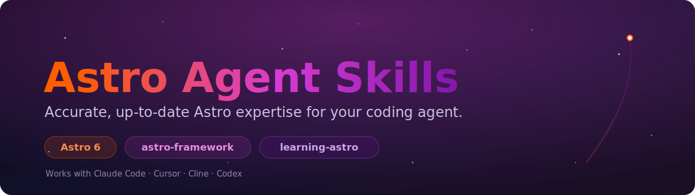

<p align="center">
  
</p>

# Astro Agent Skills

> Agent Skills for building with [Astro](https://astro.build) — current to **Astro 6**. Compatible with Claude Code, Cursor, Cline, OpenAI Codex, and any agent supporting the [Agent Skills specification](https://agentskills.io).

[](https://agentskills.io)
[](https://astro.build)
[](LICENSE)

Two skills that give coding agents accurate, up-to-date Astro expertise: a comprehensive reference for building, and an interactive tutorial for learning.

## Available Skills

| Skill | Description | Install |
|-------|-------------|---------|
| [astro-framework](skills/astro-framework/) | Astro framework reference for islands architecture, the Content Layer API, server islands, SSR adapters, sessions, actions, `astro:env`, i18n, view transitions, CSP, and the Fonts API. | `npx skills add Pythoughts-labs/Astro/astro-framework` |
| [learning-astro](skills/learning-astro/) | Interactive tutorial that teaches Astro by building a personal blog — 3 guided lessons with concepts, reflections, and hands-on code. | `npx skills add Pythoughts-labs/Astro/learning-astro` |

## Quick Start

### Install a single skill

```bash
npx skills add https://github.com/Pythoughts-labs/Astro --skill astro-framework
```

```bash
npx skills add https://github.com/Pythoughts-labs/Astro --skill learning-astro
```

### Manual installation

Clone the repository and copy the desired skill folder into your agent's skills directory:

```bash
git clone https://github.com/Pythoughts-labs/Astro.git
cp -r Astro/skills/astro-framework ~/.claude/skills/
cp -r Astro/skills/learning-astro ~/.claude/skills/
```

## Repository Structure

```
Astro/
├── README.md
├── LICENSE
└── skills/
    ├── astro-framework/        # Astro framework reference skill
    │   ├── SKILL.md            # Main skill instructions
    │   ├── AGENTS.md           # Compiled cheatsheet
    │   ├── references/         # Detailed reference docs
    │   └── rules/              # Context-specific rules (glob-scoped)
    └── learning-astro/         # Interactive Astro tutorial skill
        ├── SKILL.md            # Tutoring protocol and lesson structure
        ├── guides/             # Step-by-step lesson guides (3 lessons)
        ├── reflect/            # Reflection moments between parts
        ├── concepts/           # Deep dives on Astro fundamentals
        └── help/               # Common errors and verification procedures
```

## Skills Overview

### astro-framework

A reference skill for developers building with Astro. Covers islands architecture, the Content Layer API (glob/file/live loaders), server islands (`server:defer`), SSR adapters, view transitions, server-side sessions, actions, middleware, `astro:env`, i18n routing, image optimization, the Fonts API, and Content Security Policy. It provides decision frameworks, code patterns, and glob-scoped rules current to Astro 6.

### learning-astro

An interactive tutorial that teaches Astro from scratch by building a personal blog. Designed for beginners and developers coming from other frameworks.

**3 lessons (~45 min each):**
1. **Your First Astro Site** — Pages, components, layouts, styling
2. **Content & Dynamic Routes** — Content collections, blog posts, RSS
3. **Interactivity & Launch** — Islands, view transitions, deployment

**How it works:**
- Adapts to the user's experience level (beginner / knows other frameworks / knows Astro)
- Follows a Discover → Build → Reflect rhythm
- Uses the `astro-framework` skill for technical accuracy

## Creating a New Skill

1. Create a new directory under `skills/`:

   ```bash
   mkdir -p skills/my-new-skill
   ```

2. Create the required `SKILL.md` with frontmatter:

   ```yaml
   ---
   name: my-new-skill
   description: What this skill does and when to use it.
   license: MIT
   metadata:
     author: elkaix
     version: "1.0.0"
   ---

   # My New Skill

   Instructions for the agent...
   ```

3. (Optional) Add supporting files:
   - `references/` — detailed reference documentation
   - `rules/` — context-specific rules with glob patterns

4. Add your skill to the table in this README.

## Skill Format

Each skill follows the [Agent Skills Specification](https://agentskills.io/specification).

**Required:** a `SKILL.md` file with YAML frontmatter (`name` matching the directory, `description`) and instructions.

**Optional frontmatter:**

```yaml
---
license: MIT
metadata:
  author: elkaix
  version: "2.0.0"
  category: framework
  tags: astro, islands, ssr
compatibility: Requires Node.js 18+
allowed-tools: Bash(npm:*) Read
---
```

## Compatibility

| Agent | Status |
|-------|--------|
| Claude Code | Fully supported |
| Cursor | Fully supported |
| Cline | Fully supported |
| OpenAI Codex | Compatible |
| GitHub Copilot | Compatible |
| Windsurf | Compatible |

## Contributing

Contributions are welcome:

1. Fork the repository
2. Add or update a skill under `skills/`
3. Follow the [Agent Skills Specification](https://agentskills.io/specification)
4. Update the table in this README
5. Open a pull request

**Guidelines:**
- Keep `SKILL.md` under 500 lines (use `references/` for detail)
- Use progressive disclosure (metadata → instructions → references)
- Include clear examples
- Add `rules/` files with glob patterns for context-specific guidance

## License

MIT — see [LICENSE](LICENSE).

## Resources

- [Astro Documentation](https://docs.astro.build)
- [Agent Skills Specification](https://agentskills.io/specification)
- [Anthropic Skills Repository](https://github.com/anthropics/skills)

---

Maintained by [elkaix](https://github.com/elkaix) under [Pythoughts-labs](https://github.com/Pythoughts-labs).
